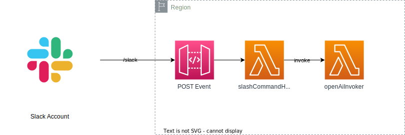
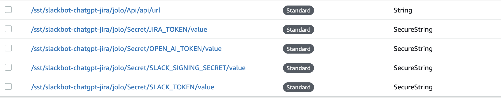
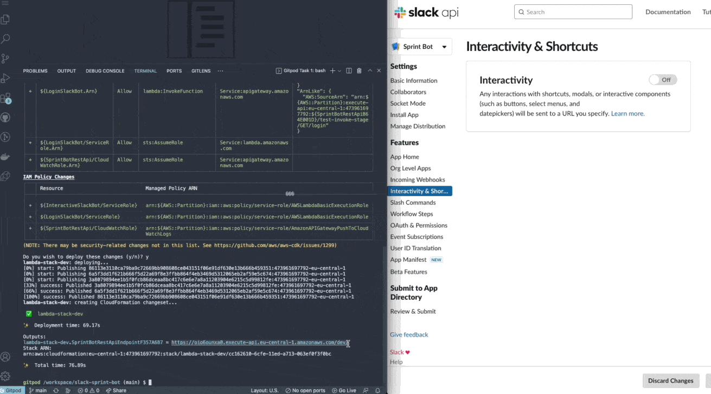

# Slackbot ChatGPT Jira

This is a template for creating SlackBots and deploying to AWS Lambda.

## Tech Stack

- Amazon API Gateway and AWS Lambda
- [Boltjs](https://slack.dev/bolt-js/tutorial/getting-started) as Slack SDK
- [Serverless Stack](https://github.com/sst/sst) as Infrastructure as code which is on top [AWS CDK](https://docs.aws.amazon.com/cdk/api/v2/index.html)

## Requirements



### Pre-requisite

- AWS Account
- Slack Account
- [pnpm](https://pnpm.io/)
- > NodeJS v16.x

### Set Token using SSM

This repo uses [SSM](https://docs.sst.dev/config).

```sh
npx sst secrets set SLACK_TOKEN my-slack-token
npx sst secrets set SLACK_SIGNING_SECRET my-signing-secret
npx sst secrets set OPEN_AI_TOKEN my-open-ai-token
npx sst secrets set JIRA_TOKEN my-jira-token
npx sst secrets set JIRA_HOST my-jira-host
npx sst secrets set JIRA_user my-jira-user
```



### Install && Deployment

```bash
pnpm install
pnpm run deploy
```

If you work with [profile](https://docs.aws.amazon.com/cli/latest/userguide/cli-configure-profiles.html), then you could do

```bash
AWS_PROFILE=my-profile pnpm run deploy
```

## Slack Configuration

This is an AWS Lambda but can be replaced by receiver which accepts HTTPS. Please, check out their [documentation](https://slack.dev/bolt-js/tutorial/getting-started). Besides the [API Tokens](https://api.slack.com/legacy/oauth), you have to have [Interactivity and Shortcuts](https://api.slack.com/messaging/interactivity#components) enabled.

### Add the URL

After deploying the app, you have to add the URL to Slack.

It also depends on what kind of SlackBot you've created.



## Development

Check the [Pre-requisite](#pre-requisite)

You should have a valid AWS Account but you can also use the `.env`. If so, please run `cp .env.template .env` and fill out the creds.

```sh
pnpm dev
```

### Troubleshooting

It can happen that the Lambda got "stucked". Just stop the current command and run again `pnpm dev`.
